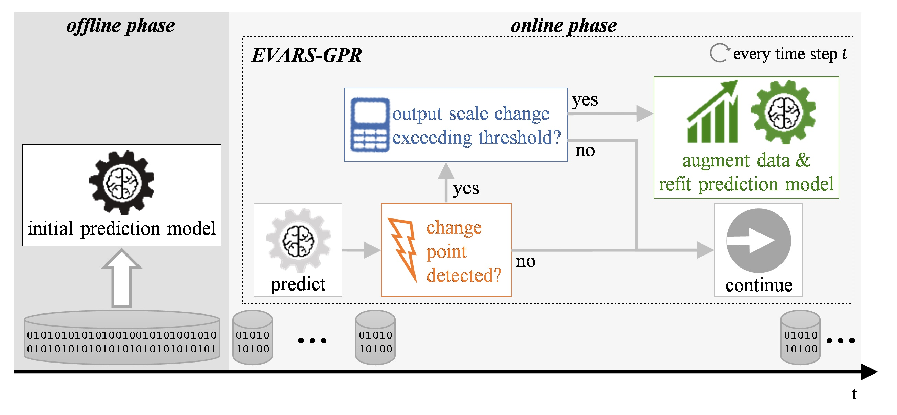

# EVARS-GPR
[](https://www.python.org/downloads/release/python-388/)
[](https://opensource.org/licenses/MIT)

This repository provides source code for **EVent-triggered Augmented Refitting of Gaussian Process Regression for Seasonal 
Data (EVARS-GPR)**, for which we provide an overview in the figure below. 
EVARS-GPR is an online time series forecasting algorithm that is able to handle sudden shifts in the target variable 
scale of seasonal data. 
For this purpose, EVARS-GPR combines online change point detection with a refitting of the prediction model using 
data augmentation for samples prior to a change point. For more information, see our publication linked below.
<p>&nbsp;</p>

<figure style="margin: 0;">
   <div style="line-height: 0;">
         
   </div>
   <figcaption><b>Figure 1. Overview of EVARS-GPR during the online phase and the preconditions in the offline phase.</b>
The initial prediction model is trained offline. 
During the online phase, the prediction of the next target value is followed by a change point detection. 
If a change point is detected, the output scaling factor, which sets the target values of the current season in relation to previous seasons, is calculated. 
If the deviation between the current and last output scaling factor exceeds a threshold, then an augmented refitting of the prediction model is triggered. 
In case one of the two conditions is not fulfilled, EVARS-GPR continues using the current prediction model. </figcaption>
</figure>

## Requirements
We recommend a workflow using [Docker](https://www.docker.com/) to ensure a stable working environment.
Subsequently, we describe the setup and operation according to it. 
If you want to follow our recommendation, **Docker** needs to be installed and running on your machine. We provide a Dockerfile as described below.

As an alternative, you can run all programs directly on your machine. 
The pipeline was developed and tested with Python 3.8 and Ubuntu 20.04.
All used Python packages and versions are specified in `Configs/packages.txt`.

## Setup and Operation
1. Open a Terminal and navigate to the directory where you want to set up the project
2. Clone this repository
    ```bash
    git clone https://github.com/grimmlab/evars-gpr
    ```
3. Navigate to `Configs` after cloning the repository
   ```bash
    cd evars-gpr/Configs
   ```
4. Build a Docker image using the provided Dockerfile
    ```bash
    docker build -t IMAGENAME .
    ```
5. Run an interactive Docker container based on the created image
    ```bash
    docker run -it -v PATH/TO/REPO/FOLDER:/DIRECTORY/IN/CONTAINER --name CONTAINERNAME IMAGENAME
    ```
    Mount the directory where the repository is placed on your machine in the Docker container.
6. In the Docker container, navigate to the to top level of the repository in the mounted directory
   ```bash
    cd /DIRECTORY/IN/CONTAINER/evars-gpr
   ```
   
### Run Offline GPR Fitting
1. We provide a framework for a random search to optimize parameters of a GPR model during the offline search
    ```bash
    python3 RunGPOptim.py 
    ```
   By default, _PotTotal_ of _CashierData_ is optimized using 80 percent of the data. 
    
   You should see outputs regarding the current progress and best values on your Terminal. 
2. Once all optimization runs are finished, you can find a file with the results, 
   their configurations and a comparison with the simple baselines in `OptimResults`. This may take several days.

You can also quit a running program with `Ctrl+C`. Already finished optimizations will be saved.

To use EVARS-GPR for your purposes, you must first run the offline optimization on your dataset. 
See the remarks below and our [horticultural sales predictions repository](https://github.com/grimmlab/HorticulturalSalesPredictions) for more information. 

### Run EVARS-GPR on real-world datasets
1. We provide an exemplary file with offline optimizations for _PotTotal_ to test EVARS-GPR
    ```bash
    python3 RunRealWorldComp.py
    ```
   By default, the optimization file of _PotTotal_ is used and EVARS-GPR as well as its comparison partners run.
   You should see outputs regarding the current progress and best values on your Terminal. 
2. Once all optimization runs are finished, you can find a file with the results, 
   their configurations and a comparison with the simple baselines in `OptimResults`.
   
To use your own data for EVARS-GPR, you must specify a result file of the offline optimization in `RunRealWorldComp.py`.

### Run EVARS-GPR on simulated data
1. You can run EVARS-GPR based on simulated data 
   1. A random search over 100 parameter combinations on the same season length. 
      A CPD and a DA method as well as a season length are set by default. You can adjust this by providing arguments via command line.
    ```bash
    python3 RunSimulatedDataTests.py
    ```

   2. A random search over 100 parameter combinations on different season lengths. 
      A CPD and a DA method are set by default. You can adjust this by providing arguments via command line.
    ```bash
    python3 RunParamSimulatedDataTests.py
    ```
   
   3. Different simulated tests regarding time of occurence, extent, speed and length of an output scale change. 
      Parameters are set by default. You can adjust this by providing arguments via command line.
    ```bash
    python3 RunHeatMapTests.py
    ```
   
2. Once all optimization runs are finished, you can find a file with the results, 
   their configurations and a comparison with the simple baselines in `OptimResults`.


## Remarks
Parameters of datasets such as the seasonality are specified via the config file `Configs/dataset_specific_config.ini`. 
There is a `General` section where we specify the *base_dir*, which is currently the same as the repository itself. 
If you want to move the storage of the datasets and optimization results, which need to be in the same base directory, 
you need to adjust the path there. 
Be careful with mounting the volume in your Docker container then, as the repository itself as well as the directory 
containing `Data` and `OptimResults` need to be accessible. Beyond that, there is a section for each target variable. 
Feel free to add a new one, if you want to use the framework for another dataset or change the settings for the existing ones.

## Contributors
This pipeline is developed and maintained by members of the [Bioinformatics](https://bit.cs.tum.de) lab of [Prof. Dr. Dominik Grimm](https://bit.cs.tum.de/team/dominik-grimm/):
- [Florian Haselbeck, M.Sc.](https://bit.cs.tum.de/team/florian-haselbeck/)

## Citation
When using this workflow, please cite our publication:

**EVARS-GPR: EVent-triggered Augmented Refitting of Gaussian Process Regression for Seasonal Data**  
Florian Haselbeck, Dominik G Grimm  
https://doi.org/10.1007/978-3-030-87626-5_11   

Keywords: Gaussian Process Regression, Seasonal Time Series, Change Point Detection, Online Time Series Forecasting, Data Augmentation.
